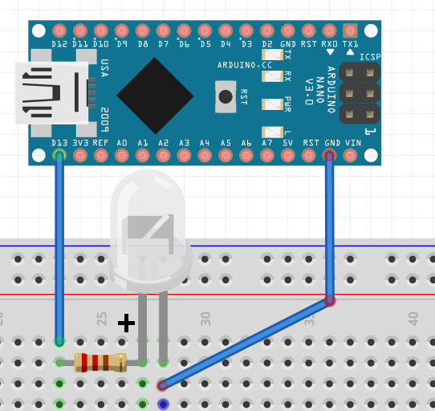
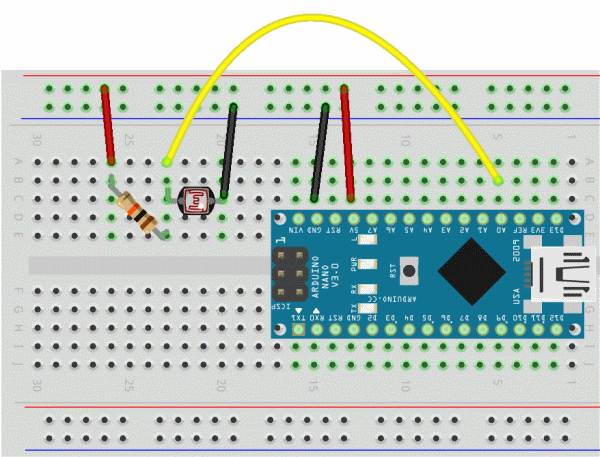

# taller-arduino

Este es un taller basico de Arduino para [Madrid North Hackerspace](https://twitter.com/northhackers).

## Kit de Taller

- Arduino Nano 5V 16Mhz
- Cable USB
- Tablero 400 pin
- Cables macho-macho
- 5 LEDs de colores
- Resistencia 330 Ohm
- Resistencia 10,000 Ohm
- Fotoresistencia (Sensor de luz)
- Botones
- Potenciómetro
- Buzzer (Zumbador)
- Servomotor 9G
- TM36 (Sensor de temperatura)

## Windows y OSX: Instalar Drivers USB CH340

Para conectar el Arduino al ordenador hay que instalar los drivers para [Windows]( drivers/CH340 windows.zip) y [OSX](drivers/CH34x_Install_V1.3.pkg). En Linux ya vienen instalados por defecto.

## Instalar el Arduino IDE

Luego hay que instalar el interfaz de Arduino:

https://www.arduino.cc/en/main/software

## Primer Desafio: Blink (Parpadeo)

## Segundo Desafio: Photoresistor (Sensor de luz)

